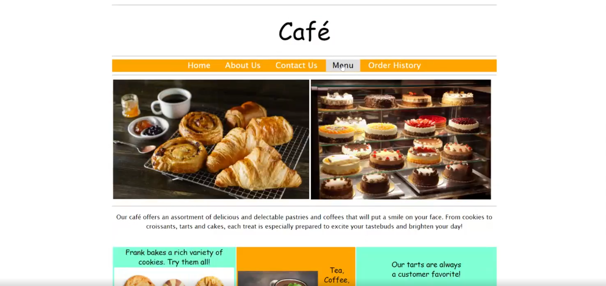

# AWS S3 Static Website Hosting & Disaster Recovery

## Overview
This project implements a highly available static website architecture for a café using Amazon S3. The deployment focuses on industry-standard practices for data durability, automated lifecycle management, and cross-region disaster recovery (DR).

## Technical Implementation

### Hosting and Security
* **S3 Static Hosting:** Configured bucket as a web server with index document redirection.
* **Access Control:** Deployed a Bucket Policy to enable public read access for website assets while maintaining private access for administrative tasks.

### Data Protection and Versioning
* **Object Versioning:** Enabled to protect against accidental overwrites and provide point-in-time recovery for website assets.
* **Rollback Testing:** Verified versioning by deploying CSS theme updates and performing manual rollbacks between object versions.

### Storage Lifecycle Management
Designed and implemented lifecycle rules to optimize storage costs:
* **Tiering:** Transition of non-current versions to S3 Standard-Infrequent Access (Standard-IA) after 30 days.
* **Cleanup:** Automated expiration and permanent deletion of previous versions after 365 days.

### Cross-Region Replication (DR Strategy)
* **Regional Redundancy:** Configured Cross-Region Replication (CRR) from us-east-1 (Source) to us-west-2 (Destination).
* **IAM Permissions:** Utilized `CafeRole` with specific S3 replication permissions to automate the data sync process.

## Project Deliverables

### Architecture Diagram

### Deployed Site Preview

## Repository Structure
* `/static-website.zip`: Source code and assets.
* `/index.html`: Main landing page with custom CSS modifications.
